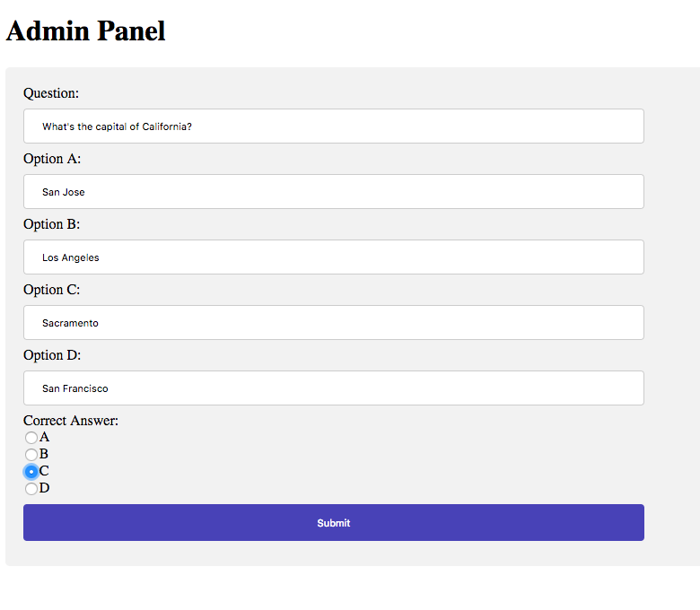
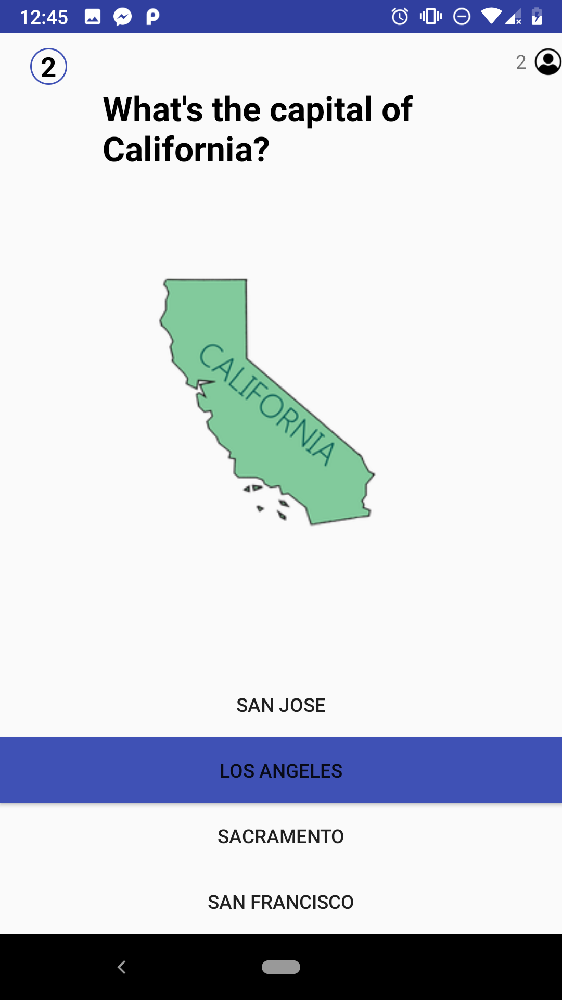

# HQDemo

HQ Demo App, built using PubNub Functions to create realtime live game show experience for players.



# QuickStart

**Sign up for PubNub click here:**

<a href="https://dashboard.pubnub.com/signup?devrel_gh=HQDemo">
    
</a>

**PubNub Functions Setup**
1. Create a new Project.
2. Go to Key Info and enable Presence, PubNub Functions, and Access Manager.
3. Create Functions module and within it create 3 functions: **getAnswers, submitAnswer, and grantAccess.**
4. Enter code for each function into its respective code editor on PubNub functions page.
5. Ensure that PubNub Functions module is started and running.

**Android App Setup**

6. Go to Key Info and take note of your subscribe key and publish key. You will need to go to the Constants.java class and enter these credentials where it says INSERT_SUBSCRIBE_KEY and INSERT_PUBLISH_KEY respectively. Enter grantAccess PubNub function URL in Constants.java class.

7. Ensure that you have the following gradle dependencies:

Module Build.gradle
``` javascript
    implementation 'com.android.volley:volley:1.1.0'
    implementation group: 'com.pubnub', name: 'pubnub-gson', version: '4.12.0'
    implementation 'com.github.PhilJay:MPAndroidChart:v3.0.3'
```
Project Build.gradle
``` Javascript
    repositories {
        maven { url 'https://jitpack.io' }
        google()
        jcenter()
    }
```    

8. Ensure that you have the following Android Manifest Permissions: 

``` xml
    <uses-permission android:name="android.permission.INTERNET" />
    <uses-permission android:name="android.permission.ACCESS_NETWORK_STATE" />
```  

**Javascript Web App setup**

9. Enter getAnswers PubNub Functions URL into code, where it says ENTER_GET_ANSWERS_PFUNC_URL on the top of index.js file.

10. Enter Subscribe Key, Publish Key, and Secret Key at the top of the index.js file also.


Congrats! You have successfully set up HQ Demo App and it is ready to run.
